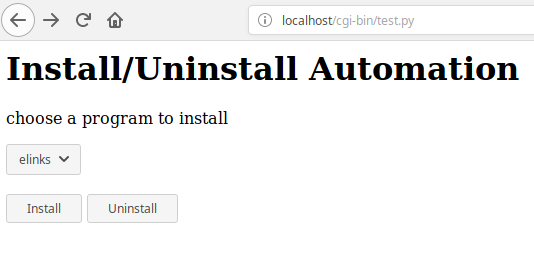
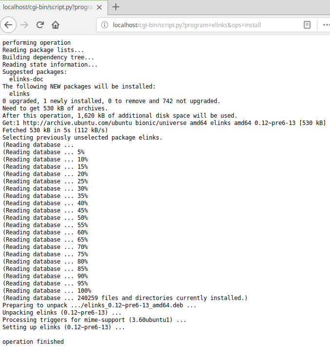

# Python CGI (App Install Automation)

- The project automates the installation and uninstallation of various linux softwares using web-browser. 
- Uses python-cgi for the implementation. 
- The project makes system vulnerable at port 80 (http) by giving apache2 created user ```www-data``` sudo priviledges.


## Requirements 

- python3
- cgi enabled 
- apache2 webserver
- web browser


## How to use

1. Refer https://techexpert.tips/apache/apache-enable-python-cgi/ for installing and enabling python-cgi.
2. Here, 2 apps are used i.e. elinks and stress for demonstration of this automation project.
3. Install all the requirements.
4. Paste both ```test.py``` and ```script``` at the path ```/usr/lib/cgi-bin/```
5. Not recommended step, goto file path ```/etc/sudoers``` and give ```www-data``` permission to get sudo priviledges with no-password
6. Restart the apache2 server and use the address ```http://localhost/cgi-bin/test.py``` in web-browser

## Screenshots








